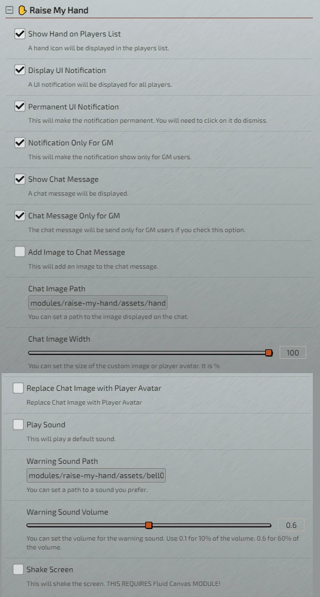
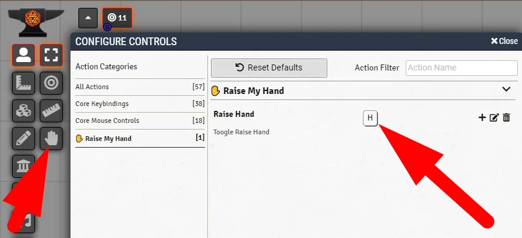

# ✋ Raise My Hand
A player can click in the hand to request attention.

## Everything you need to know is in the module settings.
<table>
<thead>
  <tr>
    <th>
      <p align="center">
        
      </p>
    </th>
  </tr>
</thead>
</table> 
<table>
<thead>
  <tr>
    <th>
      <p align="center">
        
      </p>
    </th>
  </tr>
</thead>
</table> 

## Features
- A small hand will appear next to the player name if you are in **Toogle Mode**.
- A notification warning will be displayed. You can set to everyone or just GM users. You can make the notification persistent.
- A sound will be played. You can set the sound and volume.
- A message will be sent to the chat. It will get the user color. You can use player avatar as image. You can set to everyone or just GM users.
- You can shake the screen. **Requires Fluid Canvas**.
- Foundry VTT Keybind. Check Controls.

## Localization
If you want to translate this module [DOWNLOAD THIS FILE](https://raw.githubusercontent.com/brunocalado/raise-my-hand-plus/main/lang/en.json) and translate it. After that open an issue sharing your translation. 

You also need to share with me the default name convention for your language. This is very easy to get. 
- Find a system or module which is translated to your language. 
- Open the **module.json** or **system.json** file.
- You should find something like the code above. It's under **languages**. Share with me **lang, name and path** for your language.
```json
{
  "lang": "en",
  "name": "English",
  "path": "lang/en.json"
},
{
    "lang": "fr",
    "name": "Français",
    "path": "lang/fr.json"
}  
```

## Community
- Do you found a bug? [Report it!](https://github.com/brunocalado/raise-my-hand-plus/issues)
- Do you want to send a translation? [Send it!](https://github.com/brunocalado/raise-my-hand-plus/issues)

# License
[LICENSE](https://github.com/brunocalado/raise-my-hand-plus/blob/main/LICENSE)

This module is a fork from (Raise My Hand): https://github.com/cswendrowski/FoundryVTT-Raise-My-Hand